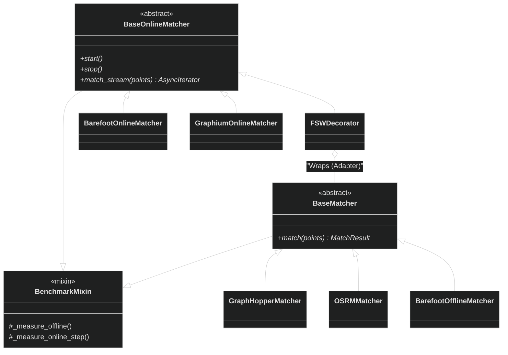
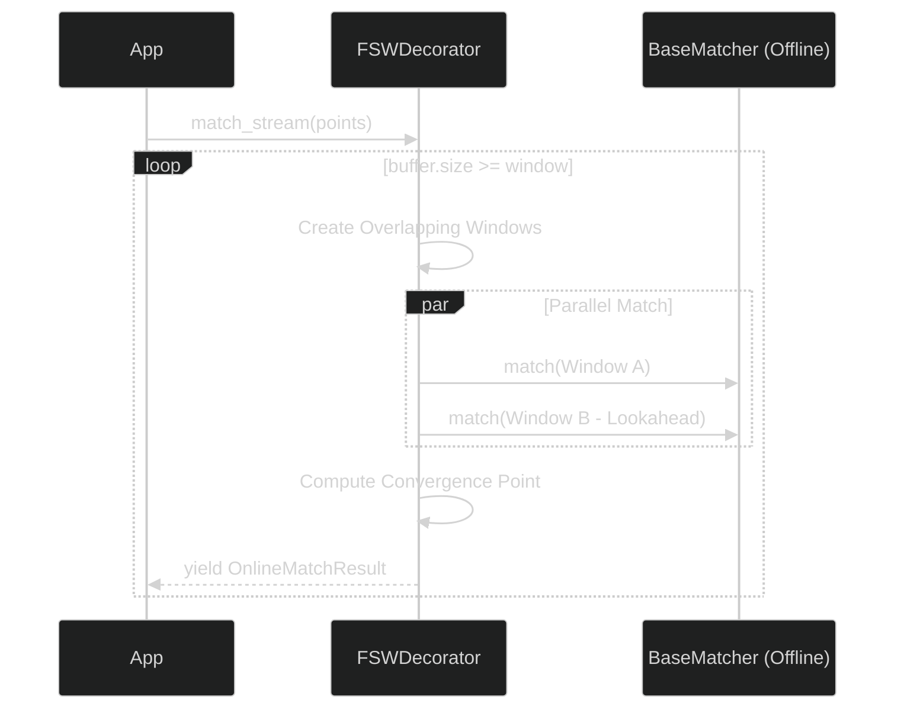
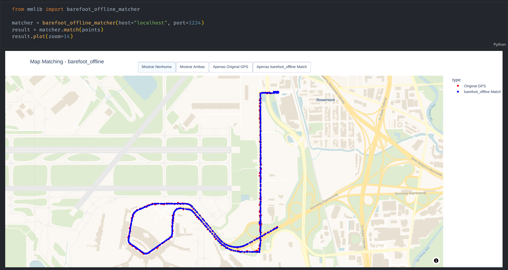
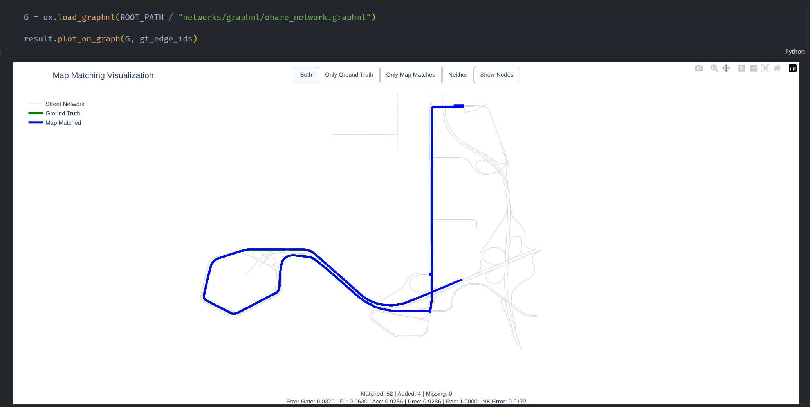
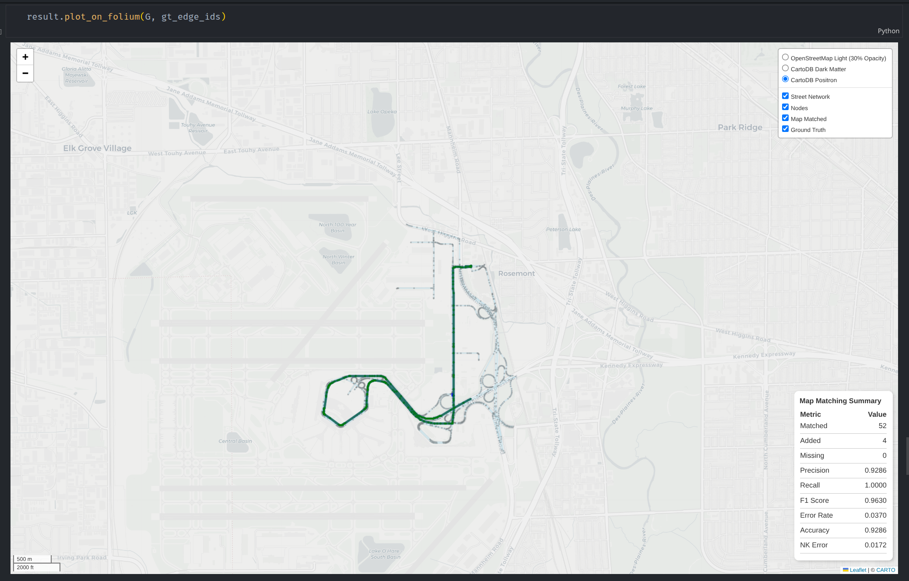

# mmlib: Interoperability Framework for Map Matching

`mmlib` is a powerful, extensible Python framework designed to unify, compare, and benchmark open-source Map Matching engines. Whether you are processing historical GPS logs (Offline/Batch) or handling real-time vehicle telemetry (Online/Streaming), `mmlib` provides a consistent interface to interact with industry-standard engines like **OSRM**, **GraphHopper**, **Barefoot**, and **Graphium**.

Beyond simple wrapping, `mmlib` introduces a sophisticated **Benchmarking System** that captures performance metrics (latency, throughput, resource usage) and quality metrics (F1, Accuracy, Spatial Error) automatically.

---

## 🚀 Key Features

* **Unified API**: Switch between map matching engines (e.g., OSRM to GraphHopper) with a single configuration change. No code refactoring required.
* **Dual Operation Modes**:
  * **Offline (Batch)**: Process complete trajectories for maximum accuracy.
  * **Online (Streaming)**: Process real-time GPS streams with sliding window strategies or micro-batching.
* **OSMnx Integration**: Seamless interoperability with OSMnx for graph management and visualization.
* **Built-in Benchmarking**: Automatically measure execution time, CPU/RAM spikes, and algorithm latency.
* **Quality Metrics**: Built-in support for standard geospatial error metrics.
* **Result Analysis**: Rich API for plotting results on interactive maps (Folium) or static graphs (Matplotlib).

---

## 🛠️ Installation

Install directly from the source using `uv` (recommended) or `pip`:

```bash
uv add git+https://github.com/JoseEdSouza/mmlib.git@main
# or
pip install git+https://github.com/JoseEdSouza/mmlib.git@main
```

*Note: You will need access to running instances of the respective map matching backend services (e.g., local Docker containers or remote APIs).*

---

## 🏗️ Architecture

`mmlib` simplifies the complexity of interacting with multiple backends through a clean, object-oriented design. *(For detailed architectural diagrams, see [ARCHITECTURE.md](docs/ARCHITECTURE.md))*

### Class Hierarchy & Logic



### Online Streaming Strategy (Fixed Sliding Window)



---

## 💻 Usage Examples

### 1. Offline Map Matching with OSRM

```python
from mmlib.matcher import OSRMMatcher
from mmlib.types import GPSPoint

# Initialize the matcher
matcher = OSRMMatcher(base_url="http://localhost:5000")

# Prepare your trajectory
trace = [
    GPSPoint(lat=-23.55, lon=-46.63, timestamp=1600000000),
    GPSPoint(lat=-23.56, lon=-46.64, timestamp=1600000010),
    # ... more points
]

# Execute matching
result = matcher.match(trace)
print(f"Matched Path Length: {len(result.matched_points)}")

# Visualize the result
result.plot()
```

### 2. Online/Streaming Strategies

#### A. Fixed Sliding Window (FSW)

Adapts any offline matcher (like OSRM) into an online stream processor using sliding windows to ensure continuity.

```python
import asyncio
from mmlib.matcher import FixedSlidingWindowMatcher, OSRMMatcher

async def run_fsw():
    # Use OSRM as the core engine
    base_matcher = OSRMMatcher(base_url="http://localhost:5000")
    
    # Configure Window: Size=5 points, Lookahead=2 points
    fsw = FixedSlidingWindowMatcher(matcher=base_matcher, window_size=5, lookahead=2)
    
    # Process a stream (assuming points_generator yields GPSPoint)
    async for result in fsw.match_stream(points_generator()):
        print(f"New matched point: {result.matched_points[-1]}")

# asyncio.run(run_fsw())
```

#### B. Batches Online Matcher

Efficiently processes streams by accumulating points into mini-batches, ideal for high-throughput scenarios where micro-latency is acceptable.

```python
import asyncio
from mmlib.matcher import BatchesOnlineMatcher, GraphHopperMatcher

async def run_batches():
    base_matcher = GraphHopperMatcher(base_url="http://localhost:8989")
    
    # Buffer 10 points before sending a request
    batcher = BatchesOnlineMatcher(matcher=base_matcher, batch_size=10)
    
    async for result in batcher.match_stream(points_generator()):
        # result contains the matched path for the entire batch
        pass

# asyncio.run(run_batches())
```

### 3. OSMnx Interoperability & Visualization

`mmlib` integrates beautifully with `osmnx` to calculate metrics and visualize results on top of the street network.

```python
import osmnx as ox
from mmlib.result import MatchResult

# 1. Load the graph for the area
G_road = ox.graph_from_place(
    "O'Hare, Chicago, Illinois, USA",
    network_type="drive",
)

# 2. Assume 'result' is your MatchResult object from a matcher
# Calculate metrics comparing the matched path to ground truth edges
metrics = result.calculate_metrics(
    graph=G_road,
    ground_truth_edge_ids=["osmid_1", "osmid_2"] # list of OSM edge IDs
)

print(f"Accuracy: {metrics.accuracy:.2f}")
print(f"F1 Score: {metrics.f1_score:.2f}")

# 3. Visualization
# Plot on interactive Folium map
m = result.plot_on_folium(graph=G_road)
m.save("map_match_result.html")

# Plot on static Matplotlib graph
result.plot_on_graph(graph=G_road)
```

---

## 📊 Result API & Visualization

The `MatchResult` object is your central hub for analysis.

### `plot`

Basic visualization comparing raw GPS points vs. Matched points on a blank canvas.
> 

### `plot_on_graph`

Visualizes the matched path directly on the NetworkX/OSMnx graph structure.
> 

### `plot_on_folium`

Generates an interactive HTML map with the street network and the matched route.
> 

---

## 🤝 Contributing

We welcome contributions! Please feel free to open issues or submit pull requests to add new matchers or improve the core framework.

## 📄 License

This project is licensed under the MIT License - see the [LICENSE](LICENSE) file for details.
