# mmlib Architecture

This document provides a comprehensive overview of the `mmlib` architecture, describing the system from multiple perspectives, focusing on its modular, extensible, and interface-oriented structure.

---

## 1. Overview

`mmlib` is a Python library designed to facilitate the usage, comparison, and benchmarking of different Map Matching engines (such as OSRM, GraphHopper, Barefoot, and Graphium). It abstracts the complexity of communicating with these services and offers a unified interface for trajectory processing in both **offline** (batch) and **online** (streaming) modes.

---

## 2. Logical View

The architecture relies heavily on object-oriented programming, utilizing abstract classes to define clear contracts and Mixins to inject cross-cutting functionalities (such as benchmarking).

### 2.1. Class Hierarchy and Interfaces

The diagram below illustrates the relationship between base classes, concrete implementers, and support mechanisms.

```mermaid
%%{init: { 'theme': 'dark', 'themeVariables': { 'primaryColor': '#2d2d2d', 'primaryTextColor': '#ddd', 'primaryBorderColor': '#777', 'lineColor': '#ccc', 'secondaryColor': '#1a1a1a', 'tertiaryColor': '#333' } } }%%
classDiagram
    direction TB

    %% --- Styling ---
    classDef abstraction fill:#2d2d2d,stroke:#01579b,stroke-width:2px;
    classDef result fill:#333,stroke:#fbc02d,stroke-width:2px;
    classDef impl fill:#1a1a1a,stroke:#9e9e9e,stroke-style:dashed;

    %% --- Core Abstractions ---
    class BenchmarkMixin {
        <<mixin>>
        +_measure_offline()
        +_measure_online_step()
        +_get_last_metrics()
        +_get_last_partial()
    }
    class BenchmarkMixin:::abstraction

    class BaseMatcher {
        <<abstract>>
        +matcher_name: str
        +match(points: list[GPSPoint]) MatchResult*
        +bench_match(points) tuple[MatchResult, BenchMetrics]
    }
    class BaseMatcher:::abstraction

    class BaseOnlineMatcher {
        <<abstract>>
        +matcher_name: str
        +start()*
        +stop()*
        +match_stream(points: AsyncIterable) AsyncIterator*
        +match_batch(points) OnlineMatchResult
        +bench_match_stream(points) AsyncIterator
        +bench_match_batch(points) tuple
    }
    class BaseOnlineMatcher:::abstraction

    %% --- Results ---
    class BaseMatchResult {
        <<dataclass>>
        +measurement_points: list
        +matched_points: list
        +edge_ids: list
        +to_df()
        +to_geojson()
        +calculate_metrics(Graph, gt_ids)
        +plot_on_map(Graph, gt_ids)
        +plot_on_graph(Graph, gt_ids)
        +plot_on_folium(Graph, gt_ids)
    }
    class BaseMatchResult:::result

    class MatchResult { <<dataclass>> }
    class OnlineMatchResult {
        <<dataclass>>
        -_update_sent()
        -_update_matched()
    }
    class MatchResult:::result
    class OnlineMatchResult:::result

    %% --- Implementations ---
    class GraphHopperMatcher:::impl
    class GraphiumOfflineMatcher:::impl
    class OSRMMatcher:::impl
    class BarefootOfflineMatcher:::impl

    class GraphiumOnlineMatcher:::impl
    class BarefootOnlineMatcher:::impl
    class BatchesOnlineMatcher:::impl

    %% --- Relationships ---
    BaseMatcher --|> BenchmarkMixin
    BaseOnlineMatcher --|> BenchmarkMixin
    
    MatchResult --|> BaseMatchResult
    OnlineMatchResult --|> BaseMatchResult
    
    BaseMatcher <|-- GraphHopperMatcher
    BaseMatcher <|-- GraphiumOfflineMatcher
    BaseMatcher <|-- OSRMMatcher
    BaseMatcher <|-- BarefootOfflineMatcher
    
    BaseOnlineMatcher <|-- GraphiumOnlineMatcher
    BaseOnlineMatcher <|-- BarefootOnlineMatcher
    BaseOnlineMatcher <|-- BatchesOnlineMatcher
    
    %% Decorator Pattern
    BatchesOnlineMatcher o-- BaseMatcher : "Wraps (Decorator)"

    %% --- Notes ---
    note for BenchmarkMixin "Provides utility methods for time measurement<br/>and hardware metric extraction."
    note for BaseMatcher "Interface for Offline algorithms.<br/>Processes the complete trajectory."
    note for BaseOnlineMatcher "Interface for Online algorithms.<br/>Supports asynchronous processing."
    note for BaseMatchResult "Centralizes export logic (Pandas/GeoJSON)<br/>and geographic visualization."
    note for BatchesOnlineMatcher "Micro-Batch implementation to<br/>adapt offline matchers for online scenarios."
```

### 2.2. Design Patterns

- **Strategy**: The family of matching algorithms is interchangeable. The client can choose between `OSRMMatcher`, `GraphHopperMatcher`, etc., without altering consumer code.
- **Decorator / Adapter**:
  - `FixedSlidingWindowMatcher` (FSW) and `BatchesOnlineMatcher` act as wrappers adapting a `BaseMatcher` (synchronous/offline) to function as a `BaseOnlineMatcher` (asynchronous/stream), adding windowing and lookahead logic.
- **Mixin**: `BenchmarkMixin` provides performance instrumentation (time, CPU, memory) non-intrusively to the core business logic.
- **Factory**: The use of `@factory` decorators facilitates the instantiation of matchers with flexible configurations.

---

## 3. Development View

### 3.1. Packages and Modules

The modular structure of `mmlib` ensures low coupling between infrastructure components (matchers), domain (results/types), and support (utils/benchmark).

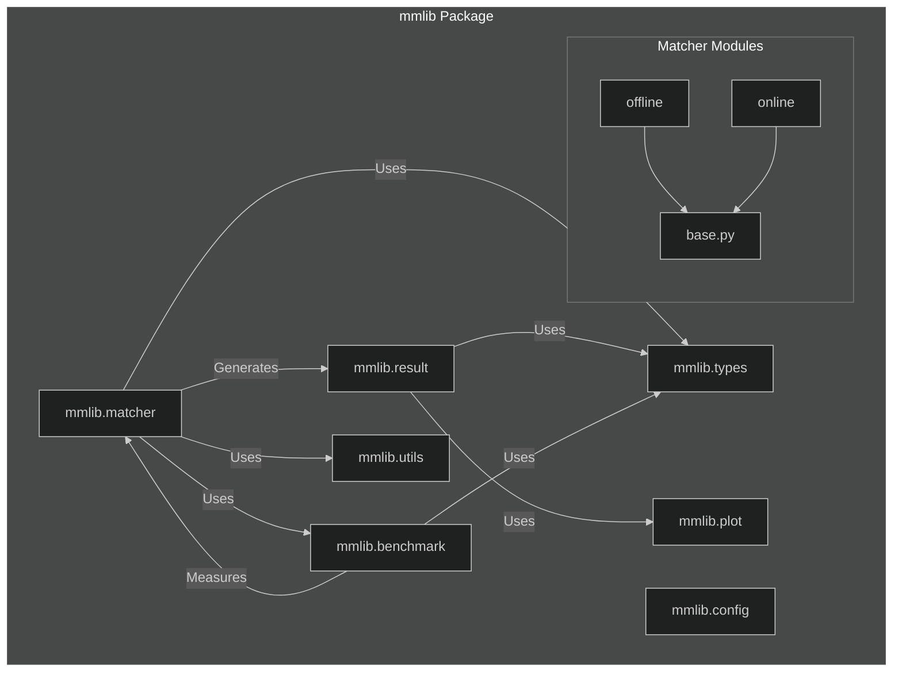

---

## 4. Process View

### 4.1. Offline Matching

#### Example: OSRM Matcher

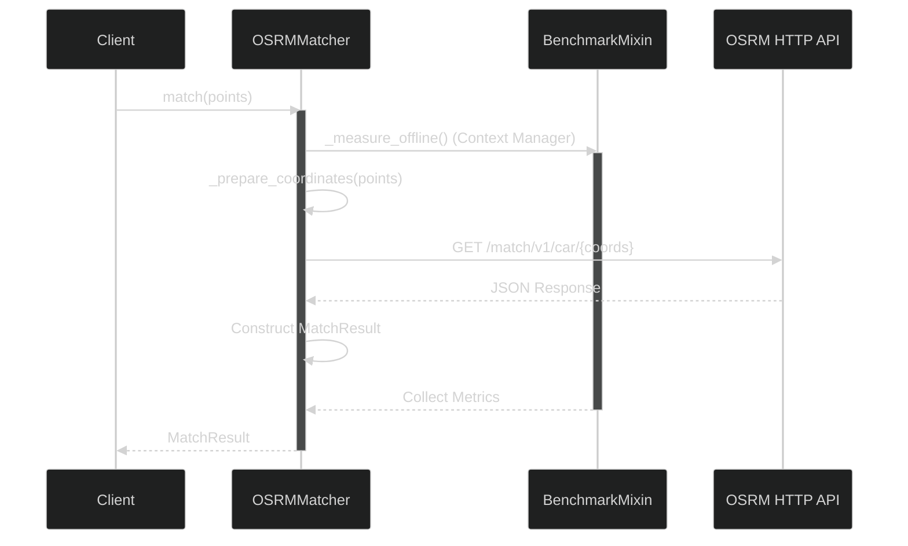

### 4.2. Online Matching (Streaming)

#### A. Barefoot Online (Stateful via TCP/ZMQ)

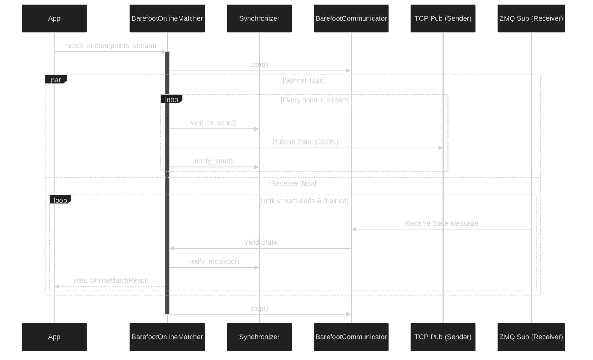

#### B. Fixed Sliding Window (FSW)

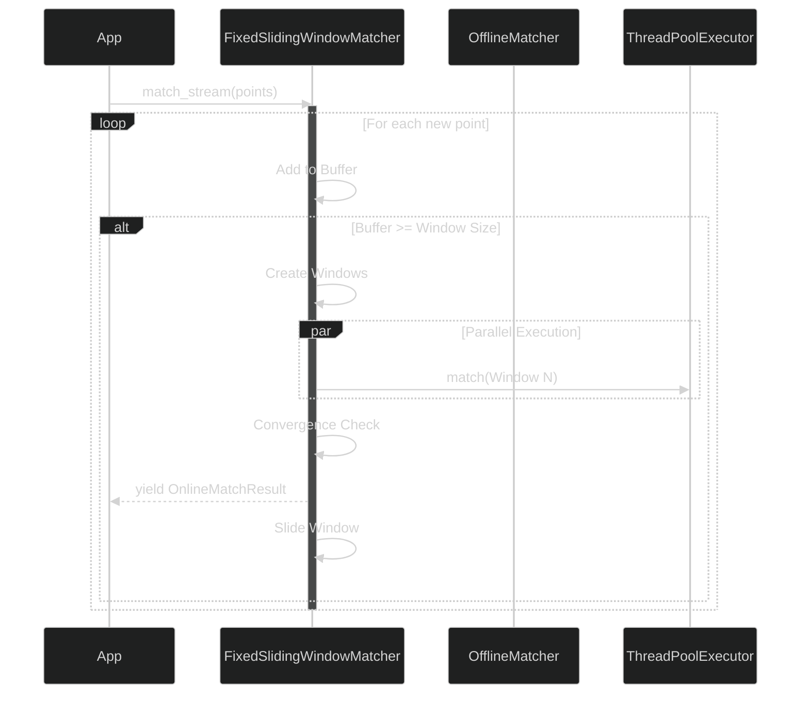

#### C. Batches Online Matcher

This matcher simplifies the online process by grouping points into fixed batches, without the complexity of overlapping sliding windows.

```mermaid
%%{init: { 'theme': 'dark', 'themeVariables': { 'primaryColor': '#2d2d2d', 'primaryTextColor': '#ddd', 'primaryBorderColor': '#777', 'lineColor': '#ccc', 'secondaryColor': '#1a1a1a', 'tertiaryColor': '#333' } } }%%
sequenceDiagram
    autonumber
    
    participant App as 🐍 Application
    participant Batcher as 📦 BatchesOnlineMatcher
    participant Executor as 🧵 ThreadPoolExecutor
    participant Offline as 🧩 OfflineMatcher

    Note over Batcher, Offline: Online Adaptation Strategy

    App->>Batcher: match_stream(points)
    activate Batcher
    
    loop For each received point
        Batcher->>Batcher: Buffer.append(point)
        
        alt Buffer Size >= Batch Size
            Note right of Batcher: Triggers async processing
            Batcher->>Executor: run(offline.match, buffer)
            activate Executor
            
            Executor->>Offline: match(buffer)
            activate Offline
            Offline-->>Executor: MatchResult
            deactivate Offline
            
            Executor-->>Batcher: MatchResult
            deactivate Executor
            
            Batcher->>Batcher: Update Accumulated Geometry
            Batcher-->>App: yield OnlineMatchResult
            Batcher->>Batcher: Buffer.clear()
        end
    end
    
    rect rgb(30, 30, 30)
    Note over Batcher, Offline: Finalization (Flush)
    alt Remaining points > Minimum for Batch
        Batcher->>Executor: run(offline.match, remaining)
        activate Executor
        Executor->>Offline: match(remaining)
        Offline-->>Batcher: MatchResult
        deactivate Executor
        Batcher-->>App: yield Final Result
    end
    end
    
    deactivate Batcher
```

---

## 5. Benchmarking and Metrics

The benchmarking system is implemented via Mixin to ensure separation of concerns.

### 5.1. Offline Measurement Flow

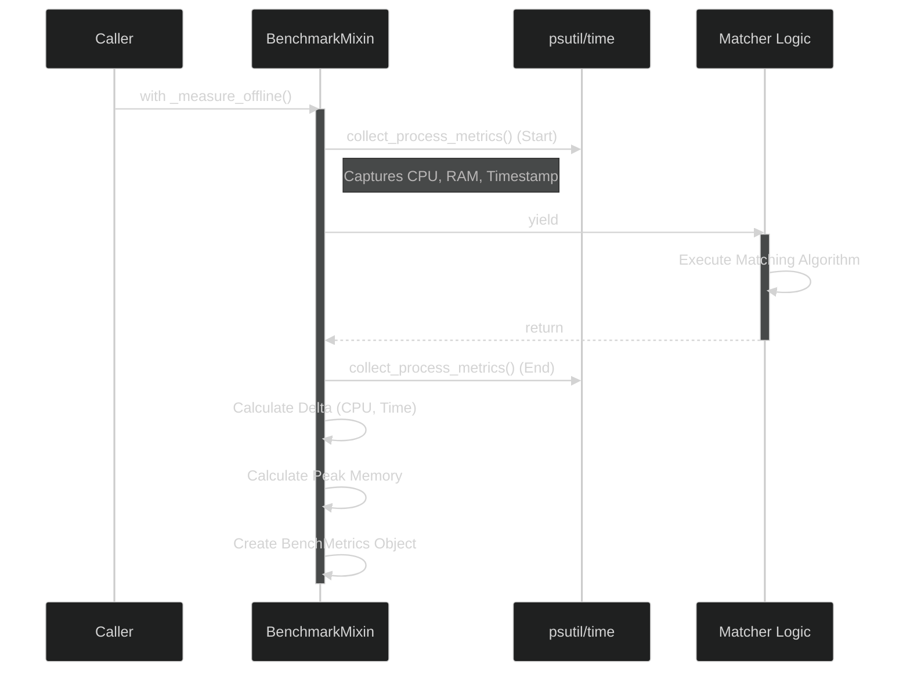

### 5.2. Online Measurement Flow (Partial Steps)

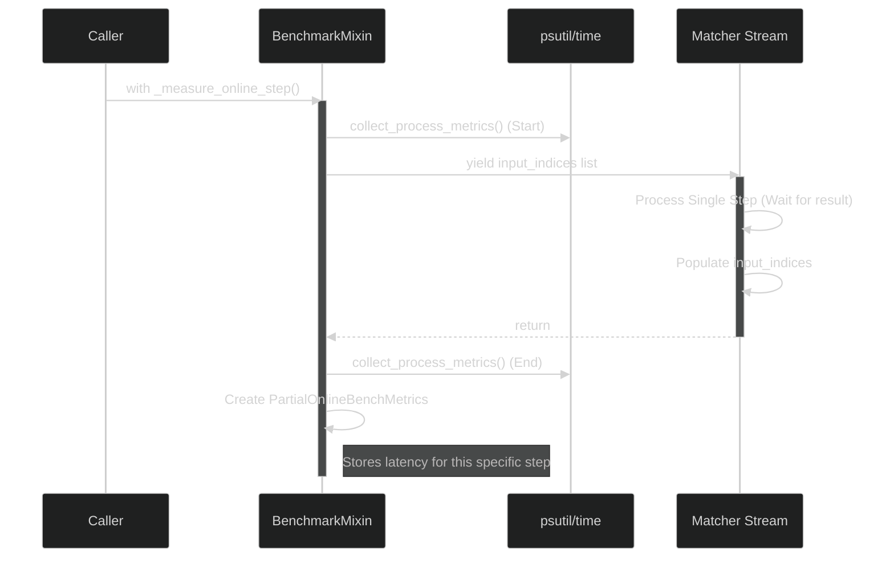

---

## 6. Final Considerations

The updated `mmlib` architecture demonstrates robustness through:

1. **Modularity**: Well-defined packages with clear dependencies.
2. **Flexibility**: Support for diverse algorithms via Strategy and Decorators.
3. **Observability**: Benchmarking deeply integrated into the architecture (Mixin), allowing granular analysis of both batch and streaming processes.

---

## 7. C4 Model

This section describes the architecture using the C4 model (Context, Container, Component).

### 7.1. Context Diagram

Illustrates how `mmlib` interacts with the user and external systems.

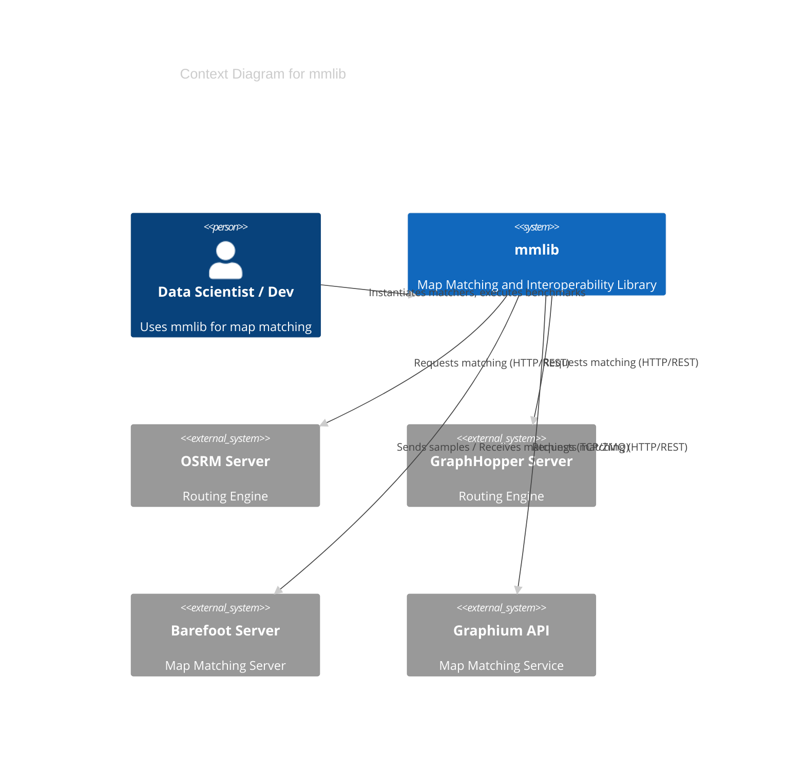

### 7.2. Container Diagram

Details the execution environments and involved technologies.

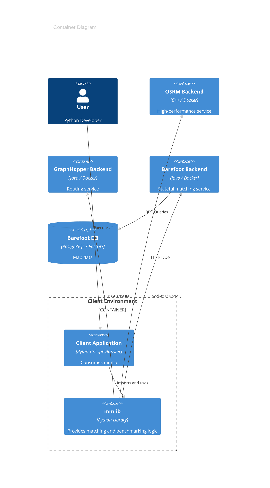

### 7.3. Component Diagram

Explodes `mmlib` into its main internal components.

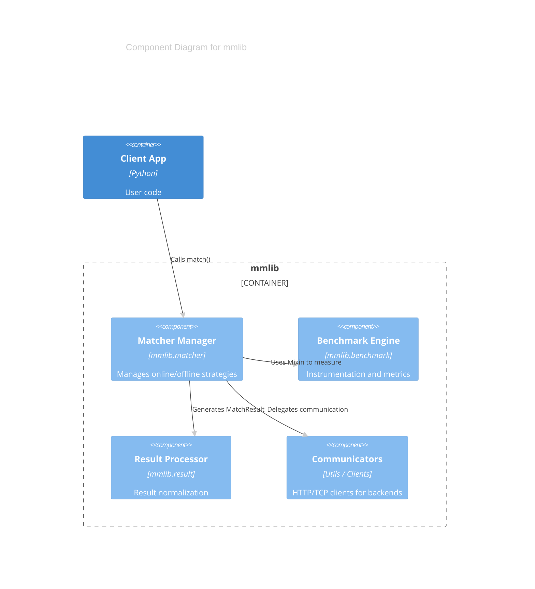
